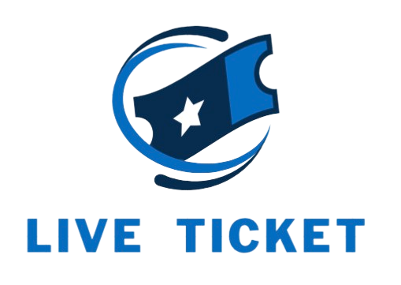
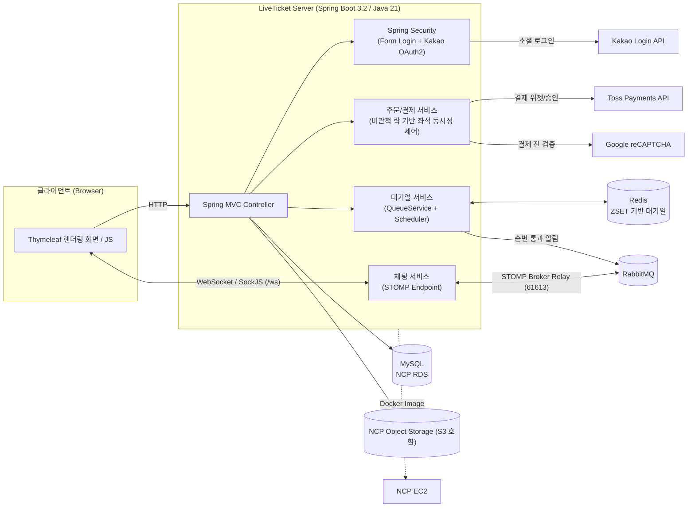

<p align="center">
  
</p>

<h1 align="center">🎫 LiveTicket (라이브티켓)</h1>
<p align="center"><b>다양한 공연·콘서트·이벤트를 온라인으로 예매할 수 있는 실시간 티켓 예매 플랫폼</b></p>

<p align="center">
  
  
  
</p>

<br/>

## 📌 목차

1. [프로젝트 개요](#-프로젝트-개요)
2. [기획 배경 및 목적](#-기획-배경-및-목적)
3. [핵심 기능](#-핵심-기능)
4. [시스템 아키텍처](#️-시스템-아키텍처)
5. [ERD](#-erd)
6. [기술 스택](#-기술-스택)
7. [API 명세](#-api-명세)
8. [기술적 도전과 해결 (트러블슈팅)](#-기술적-도전과-해결-트러블슈팅)
9. [프로젝트 구조](#-프로젝트-구조)
10. [실행 방법](#-실행-방법)
11. [개발 일정](#-개발-일정)
12. [팀원 및 역할](#-팀원-및-역할)

<br/>

## 📆 프로젝트 개요

| 항목 | 내용 |
|---|---|
| **프로젝트명** | 라이브티켓 (LiveTicket) |
| **한줄 소개** | 다양한 공연, 콘서트, 이벤트 등을 온라인으로 예매할 수 있는 플랫폼 |
| **진행 기간** | 2024.02.26 ~ 2024.03.28 (5주) |
| **팀 구성** | 백엔드 5인 (TECH!T BACK-END SCHOOL 7기 10팀) |
| **개발 방식** | Spring Boot 기반 서버 사이드 렌더링(SSR, Thymeleaf) 웹 애플리케이션 |

전통적인 예매 방식은 이동 비용·대기 시간·예약 혼선 등으로 사용자 만족도를 저해합니다. **라이브티켓**은 좌석 선택부터 결제, 실시간 문의(채팅)까지 예매의 전 과정을 온라인으로 단순화하고, 대규모 접속 트래픽에도 안정적으로 대응할 수 있는 **대기열(Queueing) 시스템**과 **좌석 동시성 제어**를 직접 구현한 실전형 티켓팅 서비스입니다.

<br/>

## 🎯 기획 배경 및 목적

> 원본 기획서(`프로젝트 기획서.pdf`) 기준 요약

- **정책·경제적 배경**: 오프라인 중심 예매는 이동 비용과 시간 소모가 크고, 코로나19 이후 온라인 예매 시스템의 중요성이 더욱 커짐
- **사회적 배경**: 시간·공간 제약 없이 예매가 가능해지면 이동이 어려운 고령자·장애인 등 취약 계층의 문화 접근성도 함께 향상됨
- **기술적 배경**: 예매량 급증 시 시스템 확장성·안정성 확보가 핵심 과제이며, 이를 위한 대기열·부하 분산 기술이 요구됨
- **제도적 배경**: 티켓 리셀러 규제, 이용자 보호 제도, 공연장 협력 체계 등을 고려한 서비스 설계 필요

**개발 필요성** — 사용자는 대기 시간 없이 좌석을 선택하고 실시간으로 예매 현황을 확인할 수 있어야 합니다.
**차별성** — 실시간 채팅으로 사용자 문의·피드백을 즉시 수용하여 서비스 개선에 반영합니다.
**기대효과** — 예매 편의성 향상, 대기 시간 단축, 실시간 소통을 통한 고객 만족도 제고.

<br/>

## ✨ 핵심 기능

### 🎟️ 예매 / 결제
- 콘서트 카테고리별 조회, 키워드 검색, 상세 페이지(공연 정보 · 공연 날짜 · 출연진 · 장소 · 후기)
- 좌석 배치도 기반 좌석 선택 및 실시간 예약 현황(이미 선점된 좌석 비활성화) 표시
- **Redis 기반 실시간 대기열 시스템**으로 트래픽 폭주 시 순번제 입장 제어
- **Toss Payments** 연동 결제(위젯 결제 → 서버 승인 API로 최종 확정) 및 결제 전 **Google reCAPTCHA** 검증
- 주문/티켓 내역 조회, 마이페이지에서 예매 내역 확인

### 👤 회원 / 인증
- 이메일 회원가입·로그인(BCrypt 암호화) + **카카오 소셜 로그인(OAuth2)** 동시 지원
- 마이페이지에서 개인정보 수정, 회원 탈퇴 시 카카오 연동 해제(Unlink) 자동 처리
- Spring Security 기반 권한 분리(`MEMBER` / `ADMIN`)

### 💬 실시간 소통
- **WebSocket(STOMP) + RabbitMQ**를 이용한 실시간 채팅 — 공연 관련 정보 및 문의를 실시간으로 공유
- 1:1 문의(Q&A) 게시판 — 결제/환불 등 카테고리별 문의 작성, 파일 첨부, 관리자 답변
- 관람 후기(리뷰) 작성/수정/삭제

### 🛠️ 관리자
- 공연 등록(공연 정보·출연진·장소·좌석·공연 이미지 S3 업로드 일괄 처리)
- 공연 목록/상세 조회, 삭제, 스케줄러 기반 공연 상태 자동 전환
- 리뷰 관리자 삭제 권한 등

<br/>

## ⚙️ 시스템 아키텍처



- **대기열 → 예매 → 결제**로 이어지는 흐름에서, 대기열(Redis)은 *유입 트래픽*을 제어하고 좌석 예약(DB 비관적 락)은 *동시 결제 시점의 정합성*을 보장하는 이중 방어 구조입니다.
- 채팅은 Spring의 인메모리 브로커 대신 **RabbitMQ를 STOMP 브로커로 직접 연결(Broker Relay)**하여, 다중 인스턴스 확장 환경에서도 메시지 브로드캐스트가 가능하도록 설계했습니다.

<br/>

## 🧱 ERD


**핵심 엔티티 관계**
- `Member` 1 : N `Order` / `Review` / `Question` / `Answer`
- `Concert` 1 : 1 `Place`, `ConcertPerformer` / 1 : N `ConcertDate`, `Image`
- `Place` 1 : N `Seat`
- `ConcertDate` × `Seat` × `Ticket` → **`ConcertSeatHistory`**(예약 확정 레코드, 공연 회차 단위로 좌석 점유 여부 관리)
- `Order` 1 : N `Ticket`

<br/>

## 📒 기술 스택

### Backend
<p>
  
  
  
  
  
  <br/>
  
  
  
</p>

### Infra / Data
<p>
  
  
  
  
  <br/>
  
  
  
</p>

### Frontend
<p>
  
  
  
</p>

### External API / Etc
<p>
  
  
  
  
</p>

### Collaboration
<p>
  
  
</p>

<br/>

## 🔌 API 명세

> 전체 컨트롤러 기준 요약. `MessageMapping`은 HTTP가 아닌 STOMP 메시지 채널입니다.

### 회원 / 인증
| Method | URI | 설명 |
|---|---|---|
| GET/POST | `/members/join` | 회원가입 폼 조회 / 처리 |
| GET | `/members/login`, `/members/login/error` | 로그인 폼 / 로그인 실패 페이지 |
| POST | `/members/revoke` | 회원 탈퇴(카카오 연동 자동 해제) |
| GET | `/oauth/kakao` | 카카오 로그인 리다이렉트 |
| GET | `/oauth/kakao/callback` | 카카오 인가 코드 → 토큰 교환 → 자동 회원가입/로그인 |
| GET | `/oauth/kakao/logout` | 카카오 연결 해제 |
| GET/POST | `/mypage/profile` | 마이페이지 프로필 조회/수정 |

### 콘서트 / 검색
| Method | URI | 설명 |
|---|---|---|
| GET | `/concert/{id}` | 콘서트 상세(간략) |
| GET | `/concert/category/{type}` | 카테고리별 콘서트 목록 |
| GET | `/concert/detail/{id}` | 콘서트 상세 페이지(일정·출연진·후기·지도) |
| GET | `/concert/search?keyword=` | 키워드 검색 |

### 대기열 / 좌석
| Method | URI | 설명 |
|---|---|---|
| STOMP `SEND` | `/app/queue/addQueue` | 콘서트 대기열 진입 요청 |
| POST | `/concert/{id}/seat` | 좌석 배치도 + 예약된 좌석 목록 조회 |

### 주문 / 결제
| Method | URI | 설명 |
|---|---|---|
| GET | `/order/{id}` | 주문 상세 |
| POST | `/order/{concertId}` | 선택 좌석 기준 주문 생성 |
| POST | `/order/{id}/pay` | 결제 정보 저장(reCAPTCHA 검증 포함) |
| GET | `/order/success`, `/order/fail` | Toss 결제 리다이렉트 결과 페이지 |
| POST | `/order/confirm` | Toss 결제 서버 승인(최종 확정) |

### 리뷰 / 고객센터
| Method | URI | 설명 |
|---|---|---|
| POST | `/review/{id}` | 후기 작성 |
| PATCH | `/review/update/{id}` | 후기 수정 |
| GET | `/review/delete/{id}` | 후기 삭제(작성자 또는 관리자) |
| GET | `/help/myqna`, `/announcement` | 내 문의 목록 / 공지사항 |
| GET/POST | `/help/question` | 1:1 문의 작성 |
| GET/PUT | `/help/question/update/{id}` | 문의 수정 |
| GET | `/help/question/{id}`, `/help/question/delete/{id}` | 문의 상세/삭제 |
| POST | `/answer/{id}` | 문의 답변 등록 |
| GET/PUT | `/answer/update/{id}`, `/answer/delete/{id}` | 답변 수정/삭제 |

### 채팅
| Method | URI | 설명 |
|---|---|---|
| STOMP `SEND` | `/app/chat/chat/messages/create` | 채팅 메시지 발행 → RabbitMQ(`amq.topic`) 브로드캐스트 |

### 관리자
| Method | URI | 설명 |
|---|---|---|
| GET | `/admin/main` | 관리자 대시보드 |
| GET/POST | `/admin/registerConcert` | 공연 등록(정보/출연진/장소/좌석/이미지) |
| GET | `/admin/concertList` | 공연 목록(페이징) |
| GET | `/admin/concertDetail/{id}` | 공연 상세 |
| GET | `/admin/deleteConcert/{id}` | 공연 삭제 |

### 기타
| Method | URI | 설명 |
|---|---|---|
| GET | `/` | 메인 페이지(최신/임박 공연, 로그인 필요) |
| GET/POST | `/recaptcha`, `/recaptcha/validate` | reCAPTCHA 데모/검증 |

<br/>

## 🧩 기술적 도전과 해결 (트러블슈팅)

### 1. 트래픽 폭주 대비 실시간 대기열
콘서트 오픈 시점에 몰리는 동시 접속을 제어하기 위해 **Redis Sorted Set(ZSET)**에 `콘서트ID`를 키로, 진입 시각(timestamp)을 score로 저장해 자연스러운 선입선출(FIFO) 순번을 구현했습니다. `@Scheduled(fixedDelay = 500)` 스케줄러가 0.5초마다 상위 순번 인원을 배치로 입장시키고, 대기 중인 인원에게는 `ZRANK` 기반 실시간 순번을 RabbitMQ를 통해 개별 통지합니다.

### 2. 좌석 중복 예매 방지 (동시성 제어)
대기열이 유입량을 조절하더라도 동일 좌석에 대한 동시 결제 요청은 발생할 수 있습니다. `OrderService`에서 `ConcertSeatHistory`와 `Seat`에 **비관적 락(`PESSIMISTIC_WRITE`)**을 걸어 좌석 단위로 트랜잭션을 직렬화함으로써 이중 예매를 원천 차단했습니다.

### 3. 확장 가능한 실시간 채팅
Spring 기본 인메모리 STOMP 브로커는 단일 인스턴스에서만 동작하는 한계가 있어, **RabbitMQ를 STOMP Broker Relay로 직접 연결**해 다중 서버 환경에서도 메시지 브로드캐스트가 가능하도록 구성했습니다.

### 4. 카카오 소셜 로그인 자체 구현
`spring-security-oauth2-client`의 기본 플로우 대신, 인가 코드 교환 → 사용자 정보 조회 → 자동 회원가입(JIT Provisioning) → `SecurityContext` 수동 등록까지 **직접 제어 가능한 커스텀 OAuth2 플로우**를 구현하여 폼 로그인 사용자와 동일한 `Member` 모델로 통합 관리했습니다.

### 5. 안전한 결제 플로우
Toss Payments 위젯 결제 이후 클라이언트 응답만으로 결제를 확정하지 않고, **서버 사이드 승인 API(`/v1/payments/confirm`) 재호출 + 결제 금액 서버 재검증**을 거쳐 위변조를 방지했습니다. 결제 진입 직전에는 Google reCAPTCHA로 어뷰징을 1차 차단합니다.

<br/>

## 📁 프로젝트 구조

```
live-ticket-dev
└─ src/main/java/com/ll/ticket
   ├─ domain
   │  ├─ member       # 회원가입/로그인/카카오 OAuth2/마이페이지
   │  ├─ concert       # 콘서트, 상세페이지, 검색, 대기열(Queue)
   │  ├─ seat          # 좌석 배치/조회
   │  ├─ order         # 주문/Toss 결제
   │  ├─ review        # 관람 후기
   │  ├─ customer       # 1:1 문의(question) / 답변(answer)
   │  ├─ chat          # 실시간 채팅(STOMP)
   │  ├─ admin          # 관리자 콘솔
   │  ├─ place          # 공연 장소
   │  ├─ ticket          # 발권 티켓
   │  └─ recaptcha       # reCAPTCHA 검증
   └─ global
      ├─ security       # Spring Security, STOMP 설정
      ├─ config / app    # Redis, QueryDSL, 외부 API Key 설정
      ├─ s3             # NCP Object Storage 연동
      ├─ jpa            # BaseEntity, Auditing
      └─ exception       # 공통 예외 처리
```

<br/>

## 🚀 실행 방법

```bash
# 1. 저장소 클론
git clone <repository-url>
cd live-ticket-dev

# 2. 필수 인프라 실행 (MySQL / Redis / RabbitMQ)
#    docker-compose.yml은 배포 환경별로 별도 구성됩니다.

# 3. 환경 변수(application.yml) 설정 — 보안을 위해 저장소에는 포함되어 있지 않습니다.
```

`src/main/resources/application.yml`에 아래 값을 채워야 합니다.

```yaml
spring:
  datasource:
    url: jdbc:mysql://<host>:3306/<db>
    username: <user>
    password: <password>
  data:
    redis:
      host: <redis-host>
      port: 6379

kakao:
  client:
    id: <kakao-rest-api-key>
    secret: <kakao-client-secret>
  redirect:
    uri: <kakao-redirect-uri>
  admin: <kakao-admin-key>
kakaoMap:
  javascript:
    key: <kakao-map-javascript-key>

google:
  recaptcha:
    key:
      site: <recaptcha-site-key>
      secret: <recaptcha-secret-key>
    url: https://www.google.com/recaptcha/api/siteverify

tossPayments:
  secretKey: <toss-payments-secret-key>

cloud:
  aws:
    credentials:
      access-key: <ncp-access-key>
      secret-key: <ncp-secret-key>
    s3:
      endpoint: https://kr.object.ncloudstorage.com
      bucket: <bucket-name>
    region:
      static: kr-standard

custom:
  file-path: <문의 첨부파일 로컬 저장 경로>
```

```bash
# 4. 빌드 및 실행
./gradlew bootRun

# 또는 Docker 이미지 빌드
docker build -t live-ticket .
docker run -p 8080:8080 live-ticket
```

기본 접속 주소: `http://localhost:8080`

<br/>

## 🗓 개발 일정

`2024.02.26 (월) ~ 2024.03.29 (금)`, 총 5주간 진행 (아이디어톤: 02.29)

| 구분 | 기간 |
|---|---|
| 주제 선정 · DB 설계 및 계획 | 1주차 |
| 회원가입/로그인/소셜로그인/마이페이지 기능 구현 | 1~4주차 |
| 채팅 · 관리자페이지 · 메인페이지 · 티켓 등록/검색 기능 구현 | 2~4주차 |
| 예매 페이지 · 좌석/티켓 상태 관리 · 상세페이지 · 후기 기능 구현 | 2~5주차 |
| 고객센터 · 개인정보수정 기능 구현 | 2~4주차 |
| 배포 | 4~5주차 |

> 상세 주차별 진행 상황은 [`record/Weekly_Log`](./record/Weekly_Log) 폴더 참고

<br/>

## 👥 팀원 및 역할

| 이름 | 역할 |
|---|---|
| 윤가영 | DB 설계, 피그마 작성, 검색 기능, 예매 페이지 및 기능, 개인정보 수정 |
| 권경현 | DB 설계, 기획서 작성, 고객센터 페이지 및 기능, 관람 후기 기능, 배포 |
| 안우성 | DB 설계, 회원가입/로그인/소셜로그인 기능, 마이페이지 구현, 채팅 기능 |
| 이예원 | DB 설계, 플로우 차트 작성, 메인페이지, 관리자페이지 및 기능 |
| 최도영 | DB 설계, ERD 작성, 예매 페이지 및 기능, 티켓 상태 변경 |

<br/>

<p align="center">TECH!T BACK-END SCHOOL 7기 · 10팀 LiveTicket</p>

